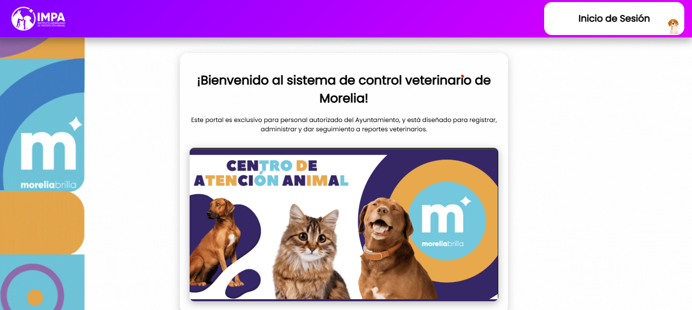
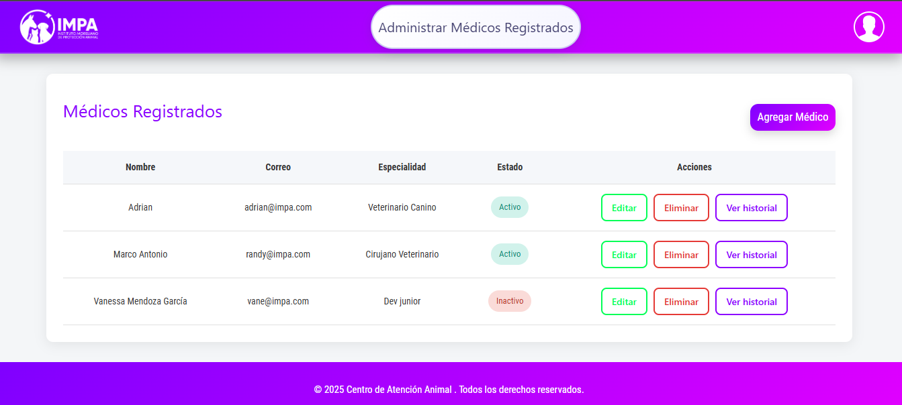
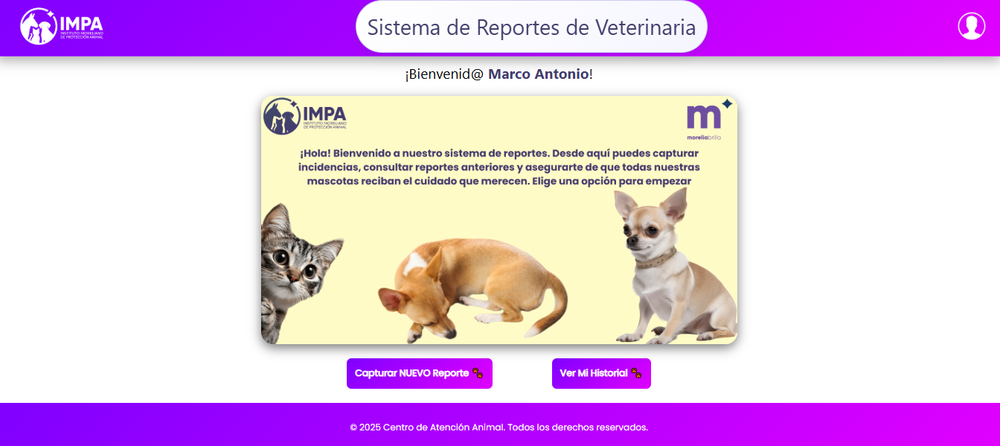
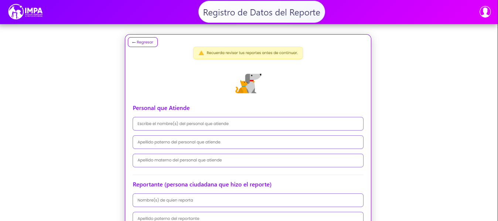
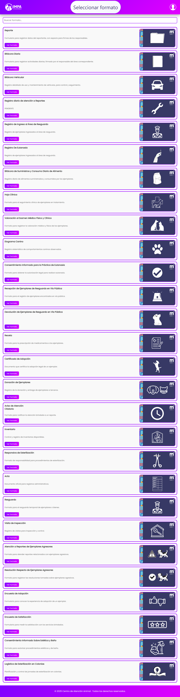
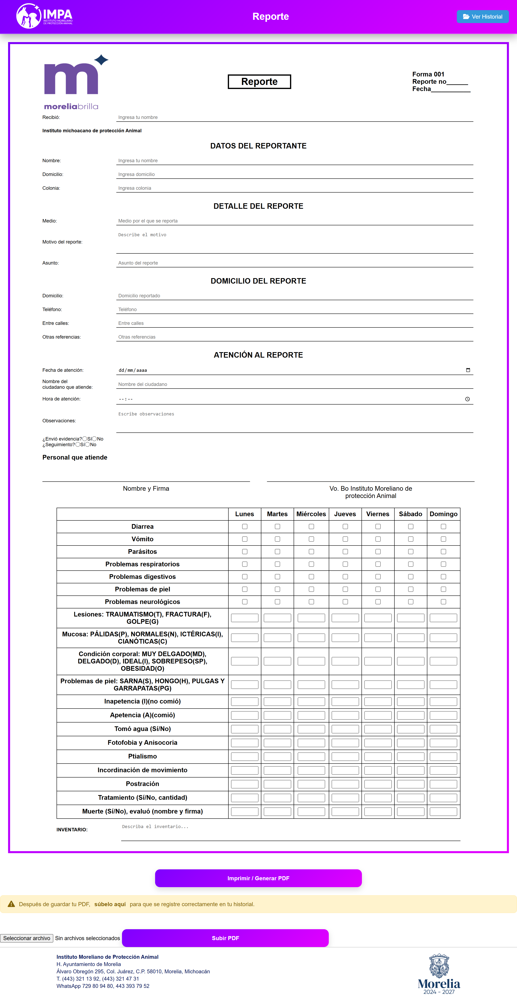
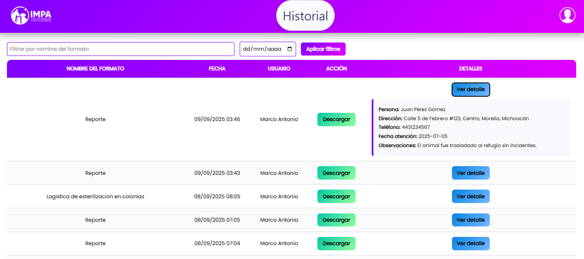
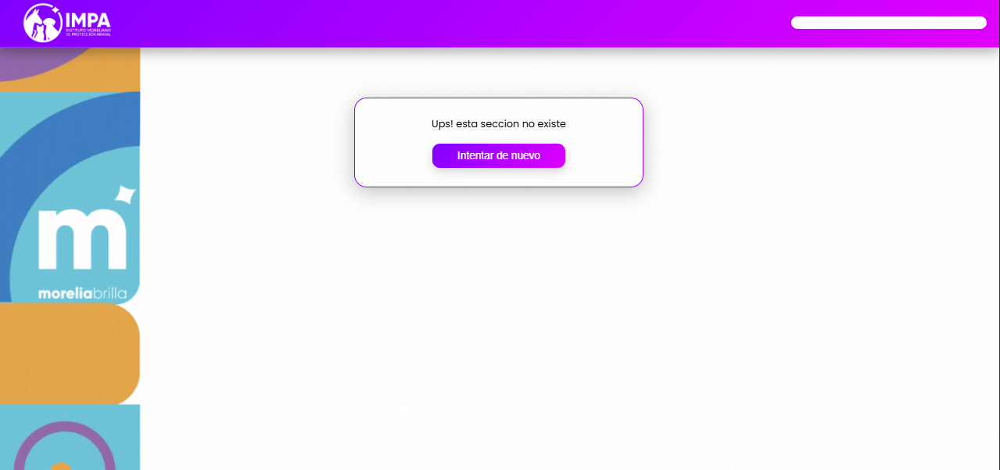

# VetFormat-IMPA 🐾

**Repositorio:** Privado  

## 📌 Descripción
VetFormat-IMPA es una plataforma web desarrollada para el **Instituto Moreliano de Protección Animal (IMPA)**, cuyo objetivo principal es **optimizar el proceso de llenado de formatos veterinarios** que anteriormente se gestionaban en Excel y no contaban con historial asociado.  

---

## ⚙️ El sistema permite
- Llenar formatos y asociarles un formulario específico.  
- Descargar cada formato en **PDF** y vincularlo con un formulario que organiza la información en 5 tablas relacionadas dadas por el cliente.  
- Consultar y administrar el historial de formatos subidos  
  - **Administrador**: acceso a todos.  
  - **Usuario**: acceso solo a los suyos.  

Con esta solución, se centraliza la información y se agiliza la identificación de cada formato con sus datos correspondientes, además de poder recurrir a ellos tiempo después.  

---

## 🛠️ Tecnologías utilizadas
- **Laravel** – Backend y gestión de rutas.  
- **MySQL** – Base de datos relacional.  
- **Blade / HTML / CSS** – Vistas personalizadas desde cero.  
- **NPM & Vite** – Entorno de desarrollo frontend.  

---

## ✨ Características principales
- Generación y subida de formatos PDF.  
- Asociación automática entre PDF y sus datos encapsulados.  
- Historial de reportes para fácil acceso.  
- Interfaz hecha desde cero con HTML + CSS.  
- Optimización de procesos internos (migración desde Excel a sistema web).  

---

## 📸 Capturas de pantalla

### Página de Bienvenida  

### CRUD del Administrador  

### Página Principal (veterinario)  

### Formulario de Información de datos (Domicilio, Fecha, Motivo de Reporte, etc.)

### Seleccionar Formato  

### Llenado de Formato  

### Historial de Formatos y datos asociados 

### Error 404  

---

## 👨‍💻 Rol en el proyecto
Este proyecto fue **desarrollado de forma independiente** (fullstack).  
- Comunicación directa con el cliente mediante un ingeniero intermediario.  
- Análisis de requerimientos, creación de **mockups** y validación continua.  
- Implementación completa del sistema desde backend hasta frontend.  
- Despliegue en servidor proporcionado por el cliente.  

---

## 📂 Estado del proyecto
Actualmente se encuentra en **uso activo** dentro del **Instituto Moreliano de Protección Animal**, brindando agilidad en el llenado y gestión de reportes veterinarios.  

---

## 📝 Notas
Este repositorio es **privado** y no se distribuye públicamente.  
El presente README tiene fines de **portafolio profesional**.  
